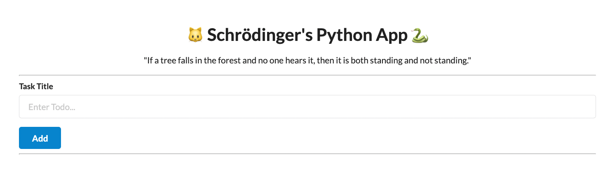

# Schrodingers Python 🐍 App 

This app is designed to demonstrate how to trace and monitor your Python applications using [lumigo](https://lumigo.io) and the [Lumigo OpenTelemetry Python Distro](https://github.com/lumigo-io/opentelemetry-python-distro)



## Commands 

These work beyond the standard todo base functionality add, delete and update routes from the base app to give you **Special Schrodinger Observability Powers**

### cat

Entering `cat` into the todo item list will create a todo item with a cat button as part of the todo entry. The cat button will increment a counter as it loops through a list of 4xx http statues to simulate http errors. 

### meow

Similar to the cat button above, `meow` entered as a todo item will activate a meow button as part of the todo entry. Clicking the button will send a meow message to a SQS queue which can be end to end traced via Lumigo 

### httpstat

creating a new todo entry using `httpstat` followed by a [http status](https://developer.mozilla.org/en-US/docs/Web/HTTP/Status) code will force that status code to be returned. Example: Entering `httpstat 418` as a todo listing will return the "Im a Teapot" http response.

## Configure 

These environmental variables need to be set as part of the apps launch to enable the SQS queue for the `meow` todo functionality to activate, These are can be obtained from you AWS and by setting up an SQS with associated permissions (stay tuned for a blog post!).

```
region_name
aws_access_key_id
aws_secret_access_key
sendQueueUrl
```

Additionally these 2 vars need to be set as part of the Lumigo Tracer Distribution, Check out the [Lumigo docs on containerized apps](https://docs.lumigo.io/docs/containerized-applications) to find out more (or the blog post)  
```
LUMIGO_TRACER_TOKEN
OTEL_SERVICE_NAME
```

## Running 

### Locally

Install the requirements via pip3 and then run the local webserver using 

```bash
pip3 -r requirements.txt
python3 app.py
```

### DOCKER 

This will build a containerized image so long as you have [docker](https://docs.docker.com/get-docker/) installed. Before running also set the SQS credentials using env vars on the container  

```bash
# This will build a docker image
docker build -t schro:latest .

# [Alternative] If you are building this on Apple Silicon for deployment on amd64, Then this is the build command you are looking for 
docker buildx build --platform=linux/amd64 -t schro:latest . 

# run the container
docker run -d -p 8080:8080 schro
```

